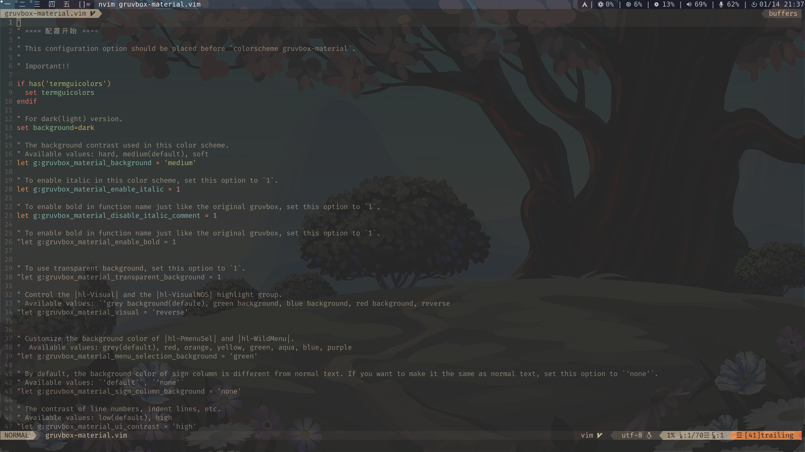

# Nvim

vim-plug

`sh -c 'curl -fLo "${XDG_DATA_HOME:-$HOME/.local/share}"/nvim/site/autoload/plug.vim --create-dirs \
       https://raw.githubusercontent.com/junegunn/vim-plug/master/plug.vim'`

1. 先安装 python2 python3 nodejs npm pynvim xclip

2. 字体 nerd-fonts

## ScreenShot

  

## 目录

    nvim(~/.config/)
      |-init.vim        默认配置
      |-map.vim         按键映射
      |-nvimrc.vim      基础配置
      |-plug.vim        插件加载
      |-plugc.vim       插件设置
      |-plug            插件目录

## 插件

使用 **vim-plug** 管理插件

- **[edge 主题](https://github.com/sainnhe/edge)** 
  
   

- **[everforest 主题](https://github.com/sainnhe/everforest)** 
  
   

- **[gruvbox-material 主题](https://github.com/sainnhe/gruvbox-material)** 
  
  

- **[material.nvim 主题](https://github.com/marko-cerovac/material.nvim)**

  

- **[auto-pairs](https://github.com/jiangmiao/auto-pairs)** 
  
  > Insert or delete brackets, parens, quotes in pair.

- **[defx.nvim](https://github.com/shougo/defx.nvim)** 
  
  > Defx is a dark powered plugin for Neovim/Vim to browse files. It replaces the deprecated vimfiler plugin.

- **[defx-icons](https://github.com/kristijanhusak/defx-icons)** 
  
  > Custom implementation of [vim-devicons](https://github.com/ryanoasis/vim-devicons) for [defx.nvim](https://github.com/Shougo/defx.nvim).

- **[vim-devicons](https://github.com/ryanoasis/vim-devicons)** 
  
  > Adds file type icons to Vim plugins such as: NERDTree, vim-airline, CtrlP, unite, Denite, lightline, vim-startify and many more.

- **[nvim-treesitter](https://github.com/nvim-treesitter/nvim-treesitter)** 
  
  > Nvim Treesitter configurations and abstraction layer.

- **[rainbow](https://github.com/luochen1990/rainbow)** 
  
  > 通过将不同层次的括号高亮为不同的颜色, 帮助你阅读世界上最复杂的代码

- **[rnvimr](https://github.com/kevinhwang91/rnvimr)** 
  
  > Rnvimr is a NeoVim plugin that allows you to use Ranger in a floating window.

- **[vim-airline](https://github.com/vim-airline/vim-airline)** 
  
  > lean & mean status/tabline for vim that's light as air

- **[vim-airline-themes](https://github.com/vim-airline/vim-airline-themes)** 
  
  > A collection of themes for vim-airline

- **[vim-choosewin](https://github.com/t9md/vim-choosewin)** 
  
  > Land on window you chose like tmux's 'display-pane'

### 感谢

- [VimAwesome](https://vimawesome.com/) - https://vimawesome.com/

- [sainnhe](https://github.com/sainnhe) - https://github.com/sainnhe

- [marko-cerovac](https://github.com/marko-cerovac) - https://github.com/marko-cerovac

- [jiangmiao](https://github.com/jiangmiao) - https://github.com/jiangmiao

- [Shougo](https://github.com/Shougo) - https://github.com/Shougo

- [kristijanhusak](https://github.com/kristijanhusak) - https://github.com/kristijanhusak

- [ryanoasis](https://github.com/ryanoasis) - https://github.com/ryanoasis

- [nvim-treesitter](https://github.com/nvim-treesitter) - https://github.com/nvim-treesitter

- [luochen1990](https://github.com/luochen1990) - https://github.com/luochen1990

- [kevinhwang91](https://github.com/kevinhwang91) - https://github.com/kevinhwang91

- [vim-airline](https://github.com/vim-airline) - https://github.com/vim-airline
